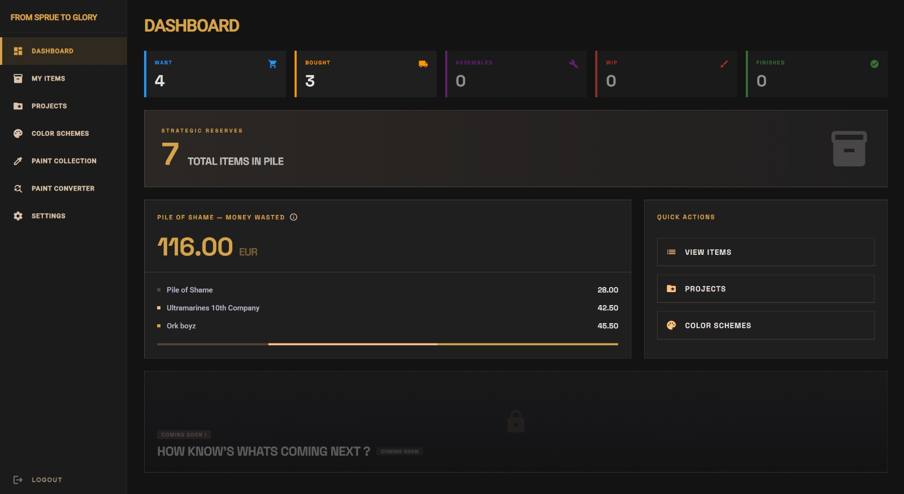
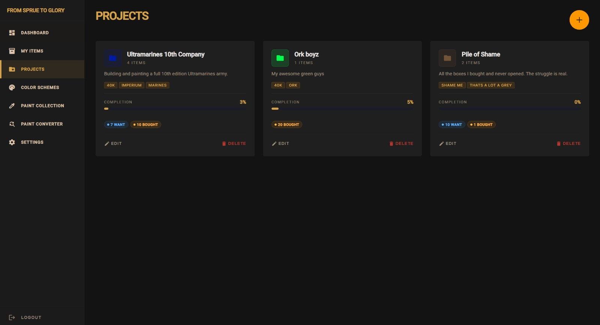
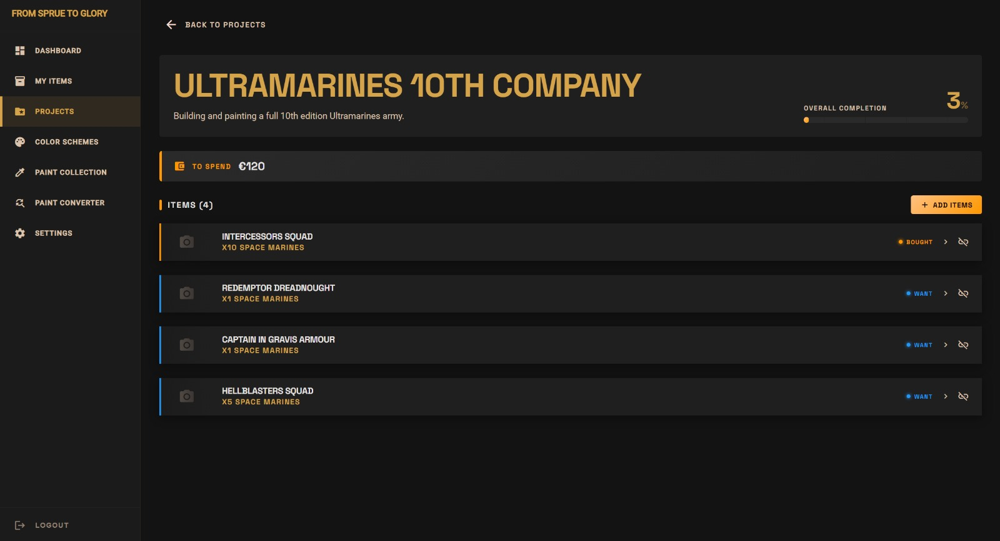
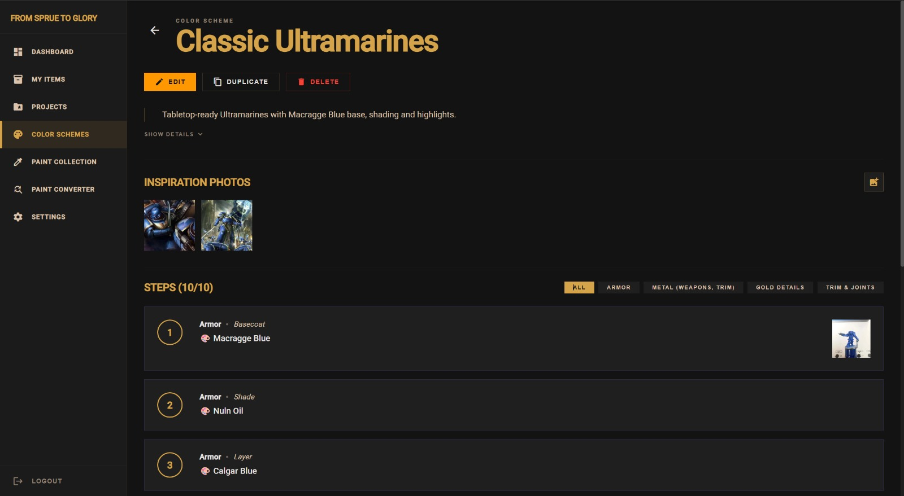
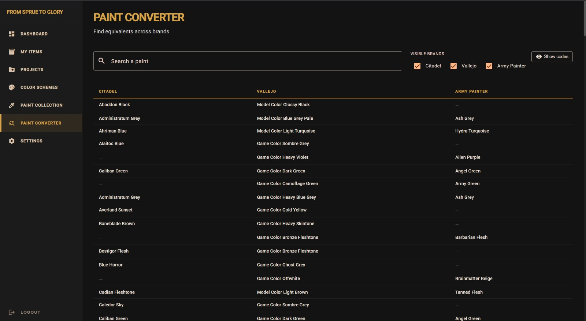

# From Sprue to Glory

Track your Warhammer pile of shame — from the box on your shelf to the model on your display cabinet.

**Live at [fromspruetoglory.com](https://fromspruetoglory.com)**


---

## What it does

Every hobbyist has the same problem: boxes you haven't opened, models half-assembled, paint jobs started and abandoned. From Sprue to Glory gives each one a status — Want → Bought → Assembled → WIP → Finished — so you know where things actually stand.

There's also a color scheme section where you can document your paint steps by layer, which turns out to be useful when you're back at the same model six months later with no memory of what you did. Projects let you group models into an army and see a real completion percentage. A paint converter helps if you're switching brands or trying to match a recipe that uses paints you don't own.

I built it to track my own pile of shame and to learn full-stack development. Both goals are ongoing.

---

## Screenshots







---

## Stack

| Layer     | Technology                                      |
|-----------|-------------------------------------------------|
| Frontend  | Angular 19, Angular Material, PWA               |
| Backend   | Express, TypeScript, Zod                        |
| ORM       | Prisma 6                                        |
| Database  | PostgreSQL 16                                   |
| Auth      | JWT + Refresh Token Rotation, Google OAuth      |
| Storage   | S3 (Railway in prod, MinIO locally)             |
| Deploy    | Railway                                         |
| Tests     | Vitest (server), Karma/Jasmine (client)         |

---

## Running locally

Prerequisites: Node.js >= 18, Docker

```bash
git clone https://github.com/Zoomma1/FromSprueToGlory.git
cd FromSprueToGlory

cd server && npm install
cd ../client && npm install

docker-compose up -d

cp .env.example .env
# Fill in JWT secrets and S3 keys

cd server && npx prisma migrate dev && npm run seed
```

Then start both servers:

```bash
cd server && npm run dev       # http://localhost:3000
cd client && npx ng serve      # http://localhost:4200
```

---

## Contributing

Fork the repo, make your changes, open a PR. No formal process.

The backend follows `routes/ → services/ → Prisma`, with Zod on all request bodies. The frontend is Angular 19 standalone — signals throughout, lazy-loaded routes, no NgRx. Run `npm test` in `server/` and `client/` before pushing; the tests are the contract, not the comments.

---

## Data Sources

- Paint catalog data: [Arcturus5404/miniature-paints](https://github.com/Arcturus5404/miniature-paints) (MIT License)

---

## License

[AGPL v3 + Commons Clause](LICENSE)

Forks and contributions are welcome. Selling a fork is not.
